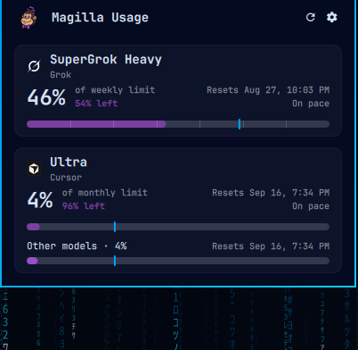
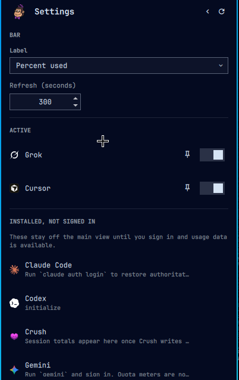

# Magilla AI Usage

A Magilla-themed [Omarchy](https://omarchy.org/) shell plugin for people who run more than one AI coding tool.

Purple derby, banana yellow, soft pink — playful enough to spot on the bar, quiet enough to live there all day. Magilla watches Grok, Cursor, Claude Code, Codex, OpenCode, and the rest of the usual suspects, then puts leftover quota, plan names, and reset countdowns in one place.

<p align="center">
  
</p>

## Features

- **Bar** — up to three signed-in providers, official icons and percent used
- **Panel** — stacked usage cards (plan, leftover, reset, pace) for accounts with live quota
- **Settings** — pin to the bar; installed tools without a login stay here until you sign in
- **Detection** — Grok, Cursor, Claude Code, Codex, OpenCode, Gemini, Copilot, Crush, Pi, Fireworks
- **Keyboard** — `Esc` closes, `R` refreshes, `S` settings, `Tab` neighboring panel

## Screenshots

<p align="center">
  
</p>

<p align="center">
  
</p>

<p align="center">
  
</p>

## Install

```bash
omarchy plugin add https://github.com/xFurti/omarchy-magilla-ai-usage.git --enable
```

The widget lands on the **right** of the bar. Move it with:

```bash
omarchy bar move io.github.xfurti.magilla-ai-usage --section right
```

Magilla can sit next to Omarchy's built-in Agents widget. If you only want one usage chip, disable the stock one:

```bash
omarchy plugin disable omarchy.agents
```

## Requirements

- **Python 3** with the standard library only. No pip packages, no extra system packages, no sudo.
- **Optional:** Omarchy's first-party `omarchy-agent-usage-claude`, `omarchy-agent-usage-codex`, and `omarchy-agent-usage-fireworks` when those CLIs are installed. Magilla reuses them if present and otherwise stays quiet.
- Collectors talk to provider APIs only with credentials already on disk (Grok `auth.json`, Cursor app session). Magilla does not store API keys, cookies, or emails.

Install and enable go through `omarchy plugin add` / `omarchy plugin enable`. Magilla does not rewrite `shell.json` or other plugins unless you change its own bar settings.

Provider product marks in `assets/icons/` remain the trademarks of their owners. Sources are listed in [`assets/SOURCES.md`](assets/SOURCES.md). Magilla is not affiliated with those tools.

## Remove

```bash
omarchy plugin remove io.github.xfurti.magilla-ai-usage
```

That disables Magilla, then deletes the git checkout under `~/.config/omarchy/plugins/`. Optional leftover caches (no secrets) live in `~/.local/state/magilla-ai-usage/` and `~/.cache/magilla-ai-usage/` — delete those by hand if you want a clean uninstall.

## How to choose which providers appear in the bar

Left-click the chip, then the gear.

1. Enable or disable each signed-in tool
2. Pin up to three providers to the bar
3. Pick a display style:
   - `percent` — used quota (`Grok 32%`)
   - `remaining` — leftover quota (`Grok 68%`)
   - `compact` — numbers only

By default Magilla only enables tools that are **signed in**. Installed CLIs without a login stay off until you turn them on in Settings.

Leave the bar list empty to auto-pick up to three signed-in tools.

From the command line:

```bash
omarchy bar set io.github.xfurti.magilla-ai-usage barSlots 'grok,cursor,claude'
omarchy bar set io.github.xfurti.magilla-ai-usage displayStyle remaining
omarchy bar set io.github.xfurti.magilla-ai-usage refreshIntervalSec 180 --json
```

Nested enablement lives under `providers` in `~/.config/omarchy/shell.json`, or:

```bash
omarchy bar set io.github.xfurti.magilla-ai-usage providers '{
  "grok": { "enabled": true },
  "cursor": { "enabled": true },
  "claude": { "enabled": true },
  "codex": { "enabled": false }
}' --json
```

## Interactions

| Action | What it does |
| --- | --- |
| Left-click the bar | Open / close the panel |
| Right-click or middle-click | Refresh now |
| `R` or Enter in the panel | Refresh |
| `S` | Toggle Magilla Settings |
| `Esc` | Close settings, then the panel |
| `Tab` | Neighboring Omarchy bar panel |

## Supported providers

Detection honors environment variables instead of baking in fragile absolute paths (`GROK_HOME`, `CLAUDE_CONFIG_DIR`, `CODEX_HOME`, `CURSOR_CONFIG_DIR`, `XDG_*`).

| Id | Tool | How Magilla finds it | Usage source |
| --- | --- | --- | --- |
| `grok` | Grok / SuperGrok | `$GROK_HOME` (default `~/.grok`), `grok` CLI, `auth.json` | SuperGrok billing pool + local `updates.jsonl` turn totals |
| `cursor` | Cursor | `$XDG_CONFIG_HOME/Cursor`, `cursor` / `cursor-agent` | Cursor dashboard plan usage (app session) |
| `claude` | Claude Code | `$CLAUDE_CONFIG_DIR`, `claude` CLI | Omarchy `omarchy-agent-usage-claude` when present |
| `codex` | OpenAI Codex | `$CODEX_HOME`, `codex` CLI | Omarchy `omarchy-agent-usage-codex` when present |
| `opencode` | OpenCode | `~/.config/opencode`, `~/.local/share/opencode` | Local session token ledger |
| `fireworks` | Fireworks | `FIREWORKS_API_KEY`, `~/.fireworks` | Omarchy `omarchy-agent-usage-fireworks` when present |
| `gemini` | Gemini CLI | `gemini` CLI, `GEMINI_API_KEY`, `~/.gemini` | Detection + local logs when present |
| `copilot` | GitHub Copilot CLI | `copilot` CLI, GitHub Copilot config dirs | Detection (quota API not public) |
| `crush` | Crush | `crush` CLI, config/data dirs | Detection + local logs when present |
| `pi` | Pi / Oh My Pi | `pi` CLI, `~/.pi` | Local session totals when present |

Missing tools fail closed: the row stays quiet instead of erroring the widget.

Magilla **does not** store API keys, cookies, or emails. Collectors read credentials already managed by the provider CLIs, use them in memory, and write only percents, plan names, and token totals.

## Development

```bash
omarchy plugin validate .
python3 collectors/magilla-usage-update --detect-only --json
python3 collectors/magilla-usage-update --force
```

For a live checkout while iterating:

```bash
omarchy plugin add "$PWD" --enable --yes
# saved QML under ~/.config/omarchy/plugins/ hot-reloads
```

Records land in `~/.local/state/magilla-ai-usage/`. Limit caches (no secrets) live in `~/.cache/magilla-ai-usage/`.

Layout:

```
magilla-ai-usage/
├── manifest.json
├── BarWidget.qml          # bar chip + panel host
├── Panel.qml              # Magilla dashboard
├── Settings.qml           # in-panel settings
├── Engine.qml             # refresh, file watchers, merge
├── Agent.qml              # one usage JSON watcher
├── Model.js / Theme.js
├── collectors/            # detection + usage (Python 3, stdlib only)
└── assets/                # Magilla mark + provider badges
```

Adding a provider: register a detector in `collectors/detect.py`, a `collect()` in `collectors/`, an icon under `assets/icons/<id>.svg`, and a row in `Model.js` `KNOWN`.

## Links

- [Omarchy](https://omarchy.org/)
- [Shell plugins manual](https://omarchy.org/manual/shell-plugins/)
- [Plugin develop guide](https://omarchyplugins.com/develop.html)
- [Omarchy Plugins marketplace](https://omarchyplugins.com/)

## License

[MIT](LICENSE) © 2026 Leonardo Bassanello (xFurti)

Third-party product logos in `assets/icons/` are trademarks of their respective owners and are used only to identify those tools. See [`assets/SOURCES.md`](assets/SOURCES.md).
